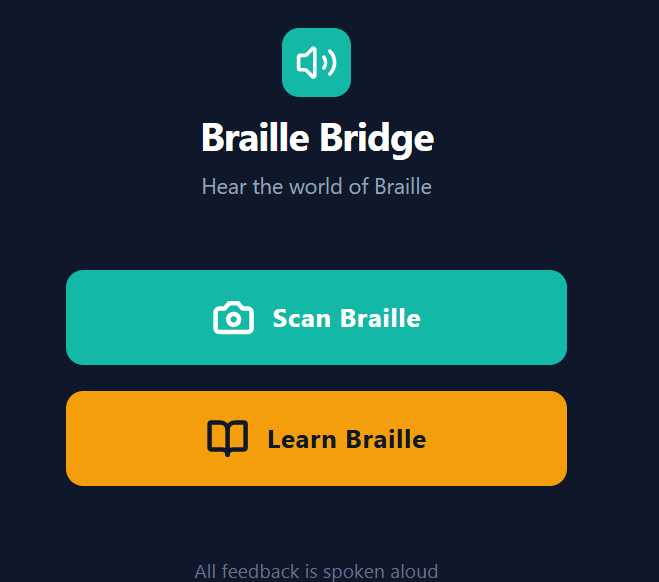
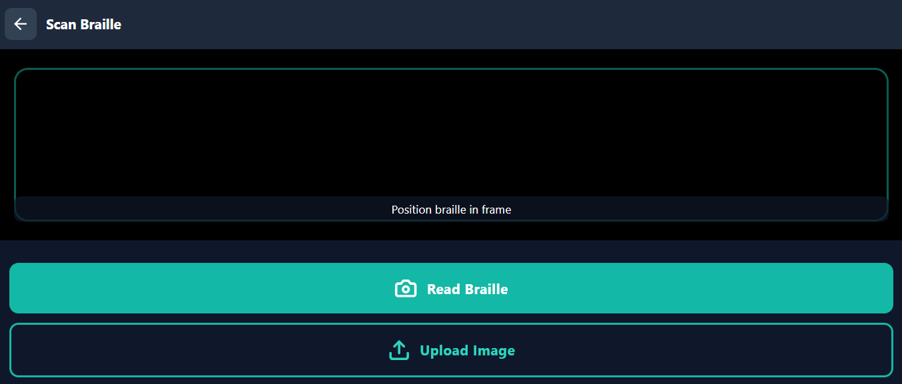
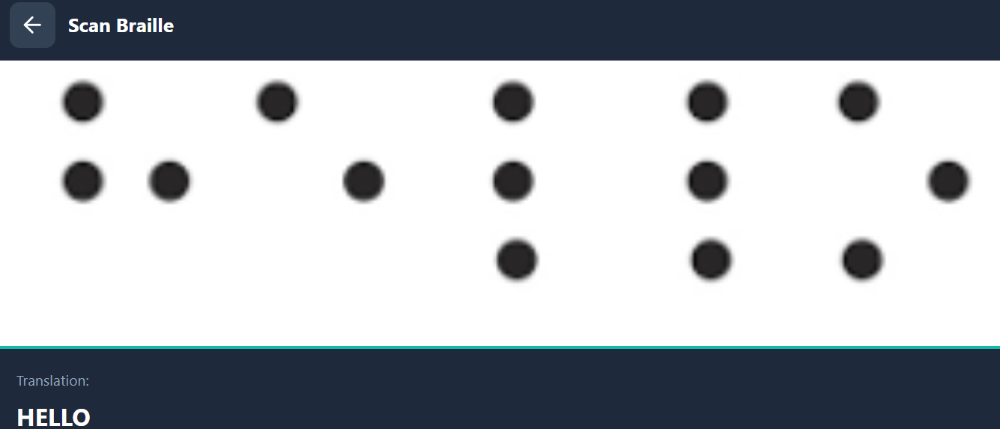
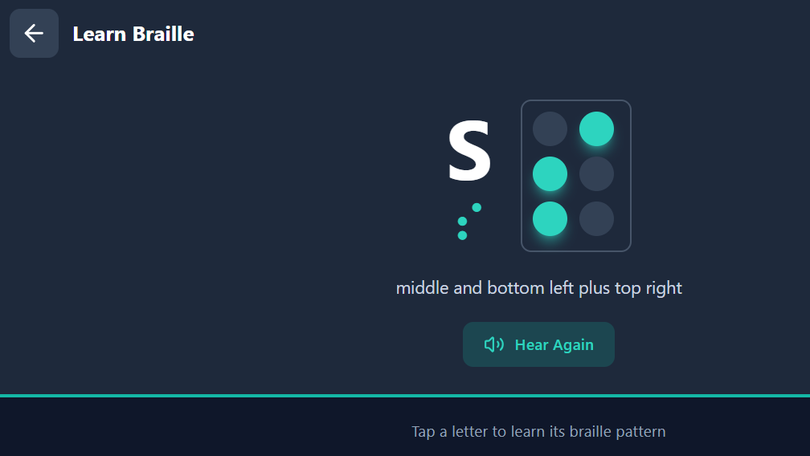

# Braille Bridge

**Braille Bridge** is an AI-powered mobile app designed to improve accessibility and inclusion for the visually impaired. It has a dual purpose:

1. **For visually impaired users who do not know Braille:**  
   - Scan physical Braille text using a phone camera  
   - Translate Braille dots into readable text  
   - Hear the translation through audio (Text-to-Speech)  

2. **For family, friends, or caregivers:**  
   - Learn Braille interactively  
   - Understand Braille dot patterns  
   - Help visually impaired individuals communicate and navigate the world  

---

## Demo App
- Base44 App Link: (https://braille-bridge-audio.base44.app)

## AI Brain
- Airia Brain Link (login required): (https://community.airia.ai/import-agent/eWKoH6eyrOulqtfZM7hvKNE9EYufctO1SJulkDagabB)
- Chat prototype: (https://airia.ai/catalog/chat/965df3ba-3d3c-493a-b791-41c384a41869?deploymentId=26afcb23-c2f2-48d2-9ffc-33af2ab3accc)

---

## Features
- Scan and translate Braille text in real-time  
- Audio-first design for visually impaired users  
- Interactive learning module for caregivers and others  
- Accessibility-first layout with large buttons and clear navigation  

---

## Architecture
Camera Input
↓
App UI
↓
Airia AI Brain
↓
Braille Translation
↓
Text-to-Speech Output
 
---
## Screenshots 

  

 
 
 

## Getting Started

1. Open the Base44 app link  
2. Explore Home, Scan, and Learn screens  
3. Use “Scan Braille” to capture text and hear it  
4. Use “Learn Braille” to practice dot patterns and letters  
5. Observe AI brain logic (Airia link) for processing Braille images  

---

## Future Work
- Real-time Braille recognition without templates  
- Multi-language support  
- Offline mode for accessibility anywhere  
- Voice guidance for navigation within the app  

---

## Notes
- Prototype built for AI accessibility challenge  
- Social impact focused: helping both visually impaired users and their community  
- Demonstrates real-world AI application with no-code tools
